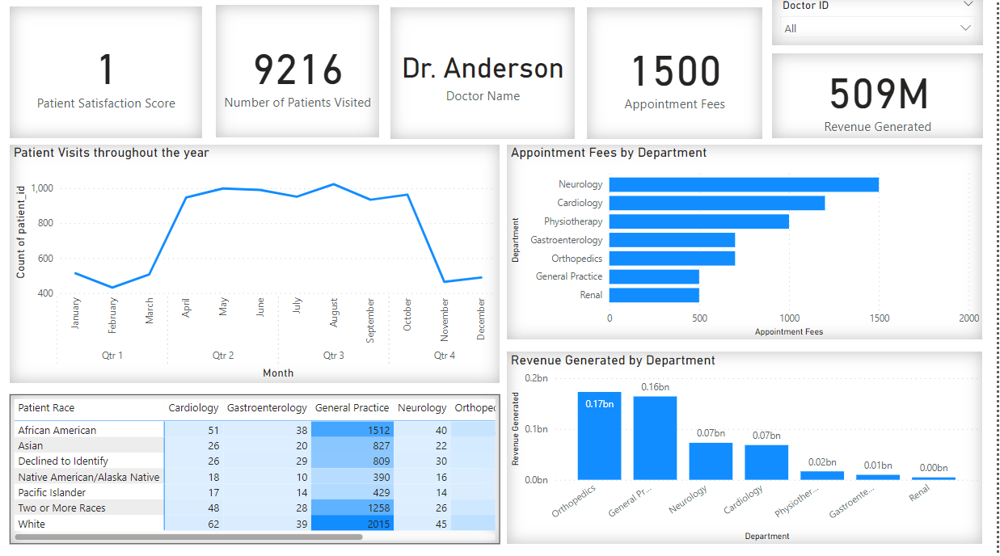
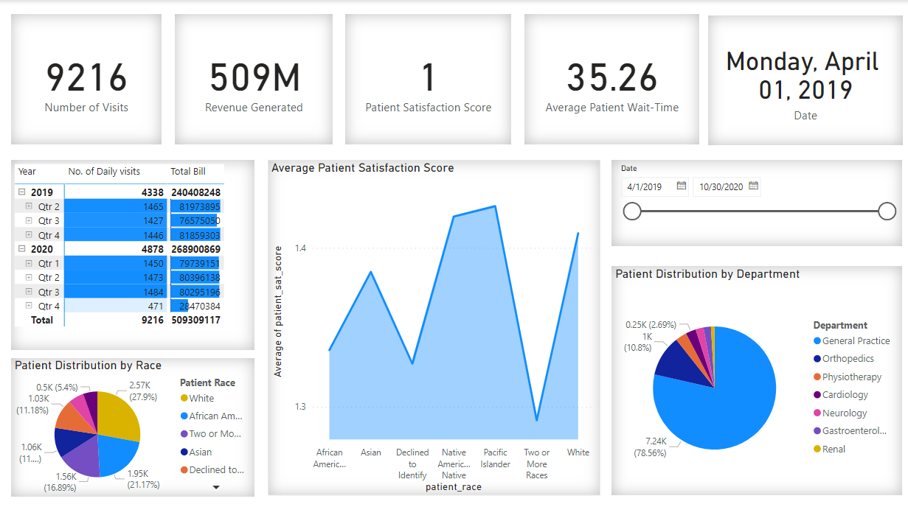
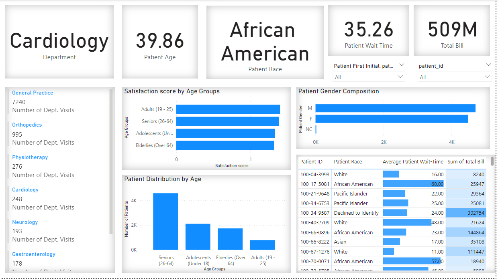

# Columbia Asia Hospital Data Analysis

## Overview
This repository contains the code and documentation for analyzing a hospital dataset from Columbia Asia Hospital. The project focuses on optimizing patient care, assessing financial health, improving operational efficiency, and providing strategic decision support through data-driven insights.

## Features
Data cleaning and preprocessing to address inconsistencies and missing values.
Correlation analysis to determine relationships between patient satisfaction scores, age groups, and racial backgrounds.
Segmentation analysis to pinpoint areas for improvement in patient experience.
Visualization of key insights using Power BI and DAX functions.

